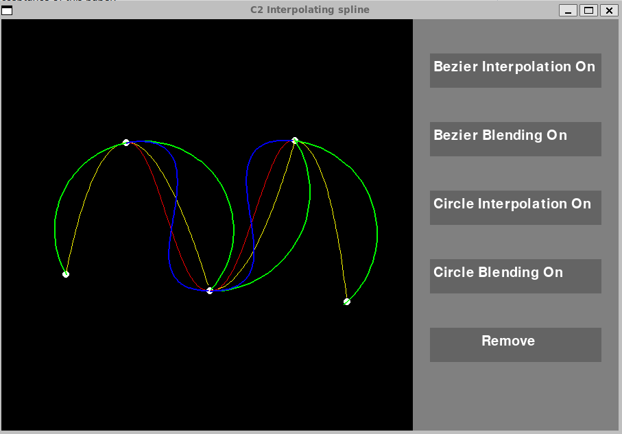
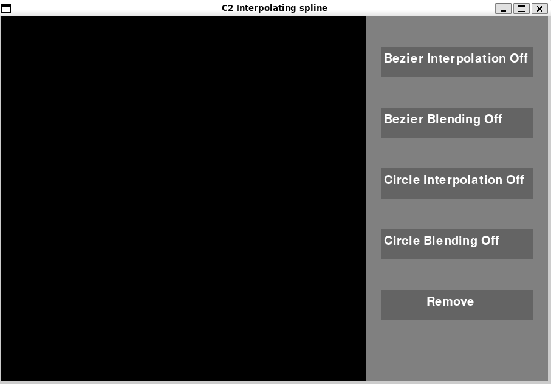
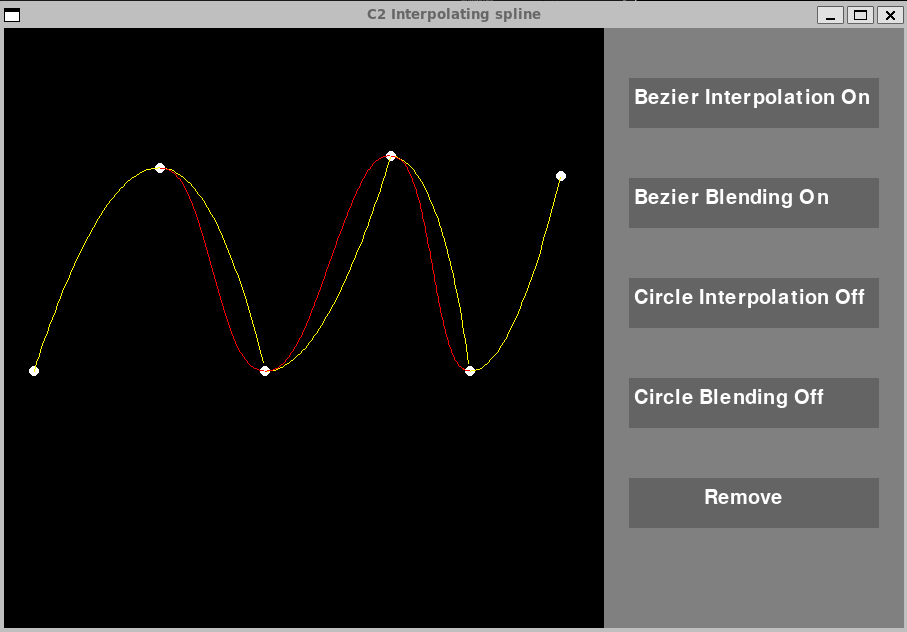
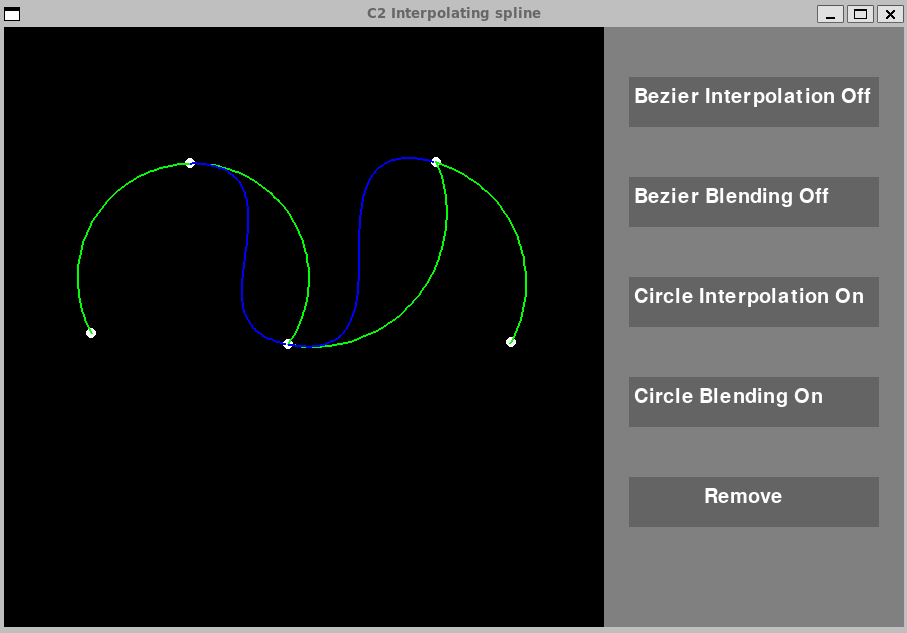

# A Implementation of A Class of C2 interpolating splines

## Author 
Harald Olin, University of Tokyo, Visual Media 2024

## Why this paper is important (what the technical core is, why the paper is accepted)

This paper provides a new method for interpolation between 4 points to create curves with guaranteed $C^2$ continuity everywhere, local support with each curve segment being controlled by only four nearby control points and direct evaluation from control points without solving a global optimization problem. 

The technical core of the paper is as follows: 
Using a known function $F_i$ which interpolates through three points $p_{i-1},p_{i},p_{i+1}$ Cem Yuksel creates a new function,$C_i(\theta)$, that he calls the blending function. The blending function is defined as follows. 
$C_i(\theta)=cos(\theta)^2\cdot F_{i}(\theta + \frac{\pi}{2})+sin(\theta)^2\cdot F_{i+1}(\theta)$, where
 $\theta \in [0,\frac{\pi}{2}]$ and $F_{i}(0)=p_{i-1},\quad F_{i}(\frac{\pi}{2})=p_{i}, \quad F_{i}(\pi)=p_{i+1}$.
The blending function interpolates a curve segment between $p_{i}$ and $p_{i+1}$, and this curve segment fulfills all the properties mentioned earlier. 

- **Guaranteed C^2 (thereby curvature) continuity everywhere**

This property is proved by calculating the derivatives of the $C$ function. Which provides smooth curves with no sharp edges. Which is essential in computer graphics and animation. For instance in hair modeling.  

- **Local support with each curve segment being controlled by only four nearby control points.**

This properity makes sure that the generated curve is only produce by the four near controlpoints, that is the shape of the curve segment will not change depending on a 5th, a 6th or any other point beside the 4 local ones. This offer better shape manipulation capabilities and more control over the curves created. 

- **Direct evaluation from control points without solving a global optimization problem.**

This ensures that we can compute the curve directly using the 4 control points and that we don't need to take any global points into account, which is less performance taxing. 

Why this paper is accepted is because the new method of $C^2$ interpolating splines offers new tools and methods for researchers and practioners alike. The paper shows 4 interpolation functions, two which I've implemented, that performs better then previous interpolation models, such as "k-curves" proposed by Yan et al 2017. 
The paper is theoretical rigorous with mathematical proofs for each stated properity in the appendix as well as throughout the paper. Smooth and flexible curve interpolation is of great interest in the computer graphics field which also contributes to the acceptance of this paper.

## What I've implemented

I've implemented a userinterface using pygame where the difference between Cem Yuksels blending function and the original interpolation can be visualized. 

In this program It's possible to: 

- Place control/points in the paintable area 
- turn on and off 
    - Bezier interpolation 
    - Bezier blending       
    - Circle interpolation  
    - Circle blending       
    - Remove everything you've painted 

Start the program by running it from the command line. Then choose which interpolations you want to see. Then start painting control points with the mouse click. You can have all interpolations running at the same time. I would suggest starting with Bezier interpolation (yellow color) and compare it with Bezier blending (Red color), to get a intuiton for how the program works but also how Cem Yuksels curves differ from the original ones. 

## Source
Cem Yuksel. 2020. A Class of C2 Interpolating Splines. ACM Trans. Graph. 39, 5, Article 160 (October 2020), 14 pages. https://doi.org/10.1145/3400301
